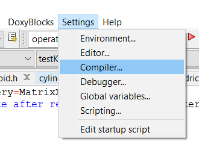
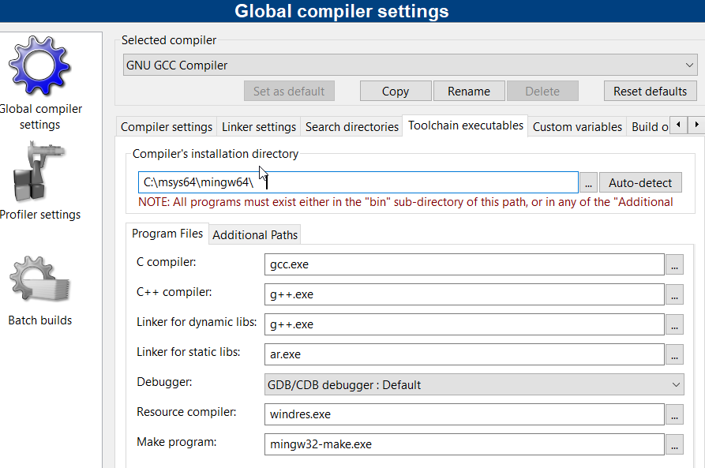
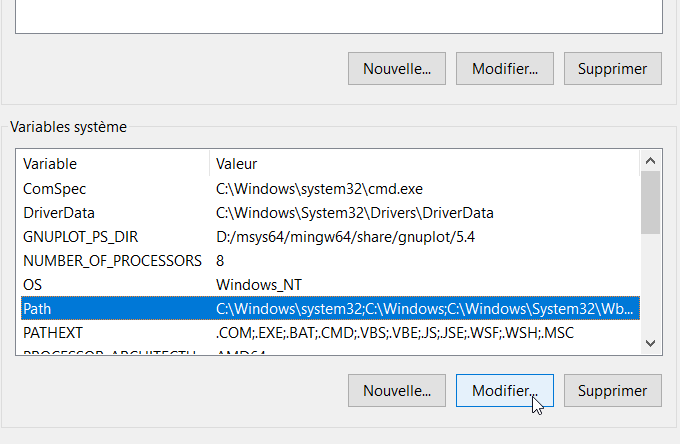
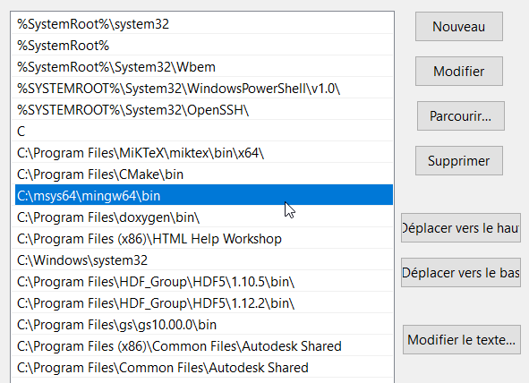

	
	<h1 style="text-align:center;"> OptiX </h1>

# A Ray-tracing Library for X-ray Beamline design
 
OptiX is a ray-traceing library for X-ray optics. 

All function are exposed in C form, though it is internally written in C++. \
For more details, see the documentation generated by Doxygen.

*At present ray tracing computations are single  threaded,
Parallel multhreading with openmp could be added later on.*

## Authors

The OptiX library was developped at __Synchrotron SOLEIL__ by [François¨Polack](mailto://francois.polack@synchroton-soleil.fr) from October 2020 to now,  
with contributions of [David Dennetiere](mailto://david.dennetiere@synchrotron-soleil.fr)

## License

OptiX is free software. It may be 

## Last updates

### July 19, 2024
All dependencies are now available in the MSYS2/Mingw-64 distribution.\n
It makes possible to distribute a Code::Blocks project file (.cbp) common to all Windows machines.\n
[See Installation section](#installation)

### June 14, 2024

V2.5

- Surface errors simulation:
  specific surface error API added to the library  (see doc)

### June-July 2023

- wavefront computations completed (natural and Legendre polynomial interpolation)
- added new aperture API (acts on ray intensity)
- ray intensity includes polarization

### March 2022  

V2.3 

New polynomial classes added : **REQUIRES last EIGEN version 3.4.0**
- Polynomial is a generic class providing intercept computations and fitting functions
- NaturalPolynomial is the specialization for natural polynomials
- *LegendrePolynomial, not yet available*

### September 2022  

V2.1 

Coatings addedd to the element definition. 
A new LoadConfigurationFile function added to the interface to ease the definition of a system.
Language is keyword and tabulation structured. Se example file config.dat.
OptiXLastError is now set when SetParameter is called with an invalid parameter name.
Many doc updates including holographic grating parameter description.

### March 29, 2022
V2.0

Coherent computation are now exposed  by the OptiX C-API with 2 new functions : WaveRadiate and GetPsf.
These functions requires a rather large number of parameters which are passed in structs.
Psf distributions can be calculated for a sequence of equally spaced planes around the estimated focus. They are returned in a four dimensions version of the ndArray struct (\see c_types.h) ). Please look at GetPsf documentation to allocate the storage space required

See interface document

In order to complete the coherent computation the transmission and reflectivity factors of the optical element must be included in the ray tracing. This will be the next extension and will be done by linking the the RefleX library presently under development. Only (simple or layer coated) mirror reflectivity is  presently available in RefleX. Gratings and Crystal will hopefully follow.

### March 20, 2022
A new development branch was started on March10, 2022, the name of which is "coherence".
The object is to extract the wavefront shape from the ray tracing and inject it into Fourier computation to get the PSF.
Two functions added to the Surface class have been added to compute the OPD of the wavefront measured on a given surface with respect to a particular focus-point in the "Surface space", and then  compute the PSF in S and P polarizations. The source used in this ray tracing must be a monochromatic point source. However a waveRadiate function has been added to the sourceBase class which radiate a point source on a uniform aperture grid, without modifying the particular source properties
The Fourier computation involve evaluation Fourier transforms of irregularly spaced data. It therefore make use of the NFFT library : https://www-user.tu-chemnitz.de/~potts/nfft/index.php.  (see #installation section)

Version number was set to 2.0 at the start of the coherence branch. Last common version before forking is 1.6.721

### February 10, 2022

An Aperture API was added to the interface. It allows to define the obstruction/transmission of the aperture associated with each optical element. The aperture affects the intensity carried by a ray. It doesn't affect the ray path, which is computed though the transported intensity might be 0.

### June 23, 2021:
New surface shape classes have been added:
ConicBaseCylinder  implements any conic based cylinder (elliptical, hyperbolic, and parabolic cylinders)
RevolutionQuadric implements  revolution quadrics (ellipsoid, hyperboloid, a paraboloid).
These shapes are only available with mirrors but could be used with gratings or films if really needed.

Compilation requires that ConicBaseCylinder.cpp and RevolutionQuadric.cpp are added to project configuration files for targets debug, release, test, and test(release)

WARNING - Starting from May 5, 2021  system can be saved in XML text format
 For this aim, it must now be linked to libxml2-2

## Installation

Under **Windows** the *OptiX* library should be compiled with the Mingw-w64 compiler (64 bits). \
MSYS2 is the recommended  building environment. It provides a suitable Mingw-w64  compiler tool-chain and all the required libraries.

OPtiX is developped in Code::Blocks IDE.  It is also the convenient environment to build the code.  Since all required libraries are now provided by MSYS2, a Code::Blocks project file *OptiX-base.cbp* is now part of the OptiX distribution. It should not need to be customized for a particular Windows file system.

### Prepararing the environment

#### MSYS2

The MSYS2 installer can be downloaded  from https://www.msys2.org/. The default installation folder C:\msys64 doesn't require to have administration rights.
Building *OptiX* requires the following libraries are installed in the mingw64 environment:
- Eigen3
- nfft *(This package will also add fftw and openmp)*
- libxml2

##### Installing packages in MSYS2/Mingw-64

 Open the MSYS2 MinGW 64-bit console 
	
	and type the following commands :

		pacman -S mingw-w64-x86_64-eigen3
		pacman -S mingw-w64-x86_64-nfft
		pacman -S mingw-w64-x86_64-libxml2

##### Some useful commands
###### querying the data base
__pacman -S *package_name*__ will check if a specific package exists in the remote database of installable packages and will prompt for installation. \
__pacman -Q *package_name*__ will check if a specific package exists in the lacal database. If no package name is given, it will list all installed packages. \
__pacman -Ss *regexp_string*__ will look if a package with matching name exists in the remote database\
__pacman -Qs *regexp_string*__ will respectively look in the local database\
__pacman -Si *package_name*__ [*respectively __pacman  -Qi__*] will provide detail information on the package

###### Removing a package
__pacman -R *package_name*__ will remove a package, but not its dependencies if any.\
to remove dependencies run __pacman -Rs__

###### Updating the packages 
__pacman -Syu__ will update MSYS2 and all installed packages 

###### Copy and paste in the MSYS2 console
Standard windows command can be used in MSYS2 console, that is:  
__copy:__ Highlight the text to copy with the mouse, then type any character key.  
It will enter the typed key in the command line and also memorize the highlighted text  
__paste:__ press *shift/insert* to paste at current cursor position

#### Code::Blocks

__Code::Blocks__ IDE  can be installed  in both Linux and Windows environments.  
It can be downloaded from https://www.codeblocks.org/.  
Two installers are available for Windows users requiring or not (local) admin rights; 

##### Configuring Code::Blocks
Check first that mingw-w64 compiler is correctly adressed. 
<figure>
	 
	<figcaption> Open  Code::Blocks settings/compiler menu, and check the path to the toolchain executables.</figcaption>
</figure>
<figure>
	<figcaption>It should look like this: </figcaption>
	
</figure>

The  <i>"compiler's installation directory"</i>  is referred by Code::Blocks internal variable <b>$(TARGET_COMPILER_DIR)</b>.   
In order that headers and libraries are correctly found, it *must point* to the directory which contains the bin, include and lib sub-directories (usually mingw64). 

### Building the library

Open the provided OptiX-base.cbp project file with Code::Blocks.  
Select the Release target and build it. If the above steps were completed as described, there is no need of updating the paths to dependent libraries.
Th e compiled dll, is available in OptiX/release

### Complete the *path*  environment variable of Windows 

Windows environment variables can be modified  via the "Advanced settings" panel which is access in System/About/Advanced  settings (french système/A propos de/paramètres avancés du Système).

 
	
	

Edit the variable _path_ of the System variable group

 
	

Verify that the mingw64/bin directory is in the path. Add it if not.
